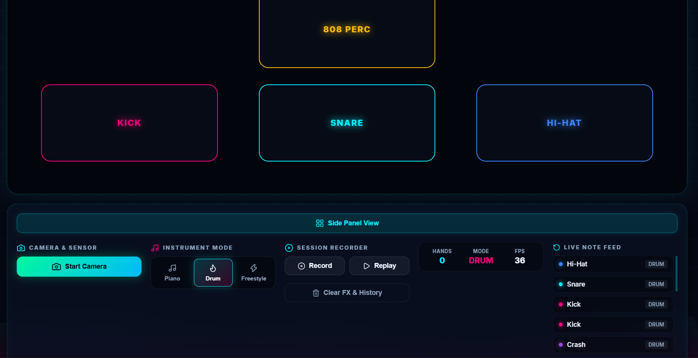

# Air Instruments Pro v2.0 🎯


## Basic Details
### Team Name: [Chads]


### Team Members
- Team Lead: Savio Sajeev - Jyothi Eng College
- Member 2: Nived Krishna - Jyothi Eng College

### Project Description
Air Piano is an interactive web application that uses real-time hand tracking to turn hand movements into a virtual musical instrument. Even though its not that useless or anything ehe,  Users can play piano notes, create effects, and interact with the interface using only their hands, without touching a physical keyboard.

### The Problem (that doesn't exist)
People who have allergies to physical musical instruments suffers a lot. And many other who really want to up their skill in a sudden urge.

### The Solution (that nobody asked for)
Thats why we have Air Instrument pro. Instead of buying a any musical instruments, we simply point a webcam at your hands and convince the computer that the air is a piano or a drum ehe

## Technical Details
### Technologies/Components Used
For Software:
- Languages used: TypeScript,TSX (TypeScript + JSX), CSS, HTML
- Frameworks used: React 18, Vite 5
- Libraries used: Tone.js, MediaPipe Hands
- Tools used: Node.js, TypeScript Compiler, Vite CLI, MediaPipe WASM, Browser WebRTC, Web Audio API, MediaRecorder API, Canvas 2D API, reqAnimationframe 

### Implementation
For Software:
# Installation
```bash
git clone <your-repo-url>
cd air-instruments
npm install
```

# Run
```bash
# start the dev server (opens on http://localhost:3000)
npm run dev

# build a production bundle
npm run build

# preview the production build locally
npm run preview
```

### Project Documentation
For Software:

# Screenshots (Add at least 3)
 
*Drum mode with six air-triggered pads. The side panel shows live hand count, active mode, and FPS, plus a running Live Note Feed of every hit.*


*drum pads get the full width of the screen by using wide view— useful for demoing on a projector or larger display.*

 
*Piano mode mapped across a C4–E5 range. Each key lights up in its own color when played, and the Session Recorder (Record / Replay) sits in the side panel alongside the mode switcher.*

 
*Freestyle mode running live with the camera on. MediaPipe's 21-point hand skeleton is overlaid in real time, and on-screen text maps each gesture: wand movement for a melodic stream, index-finger pinch for chords, middle-finger pinch for bells, and two hands together for sub bass.*

# Diagrams
 
*The flow from opening the browser to hearing a note: the webcam feed is read locally, MediaPipe turns it into hand landmarks, those landmarks are mapped to whichever instrument mode is active, and every trigger fans out to sound (Tone.js), visuals (Canvas), the live feed, and — if recording — the session recorder.*

### Project Demo
# Video
https://drive.google.com/drive/folders/1LHeyknBitQ7ZeyXltvCpCuRSrLPL0bp-?usp=sharing
*This is Air Instruments Pro — a browser-based app that turns your webcam into a musical instrument, no hardware needed. I'll start the camera , which uses MediaPipe to track my hand in real time. First, Piano mode — each position in the air maps to a note, so I can play a melody just by moving my fingers. Next, Drum mode — same camera, different mapping, now I'm hitting a kick, snare, hi-hat, and crash just by moving my hand into each zone. Then there's Freestyle mode, which reads gestures instead of fixed zones. Finally, the Session Recorder — I can record a short performance and replay it back by automatic download in the browser itself. Everything you're seeing is running live in the browser, powered by hand tracking and Tone.js for the audio. I can also delete the FX and history of what all keys i have played.*

## Team Contributions
- Savio Sajeev: Built the hand-tracking pipeline (MediaPipe integration, landmark smoothing, gesture-to-zone mapping for Piano/Drum/Freestyle), set up the camera and WebRTC handling, and led the overall app architecture.
- Nived Krishna: Built the audio engine with Tone.js, designed the UI components, and handled the visual effects layer (Canvas glow, particle trails, freestyles).

---
Made with ❤️ at TinkerHub Useless Projects 


